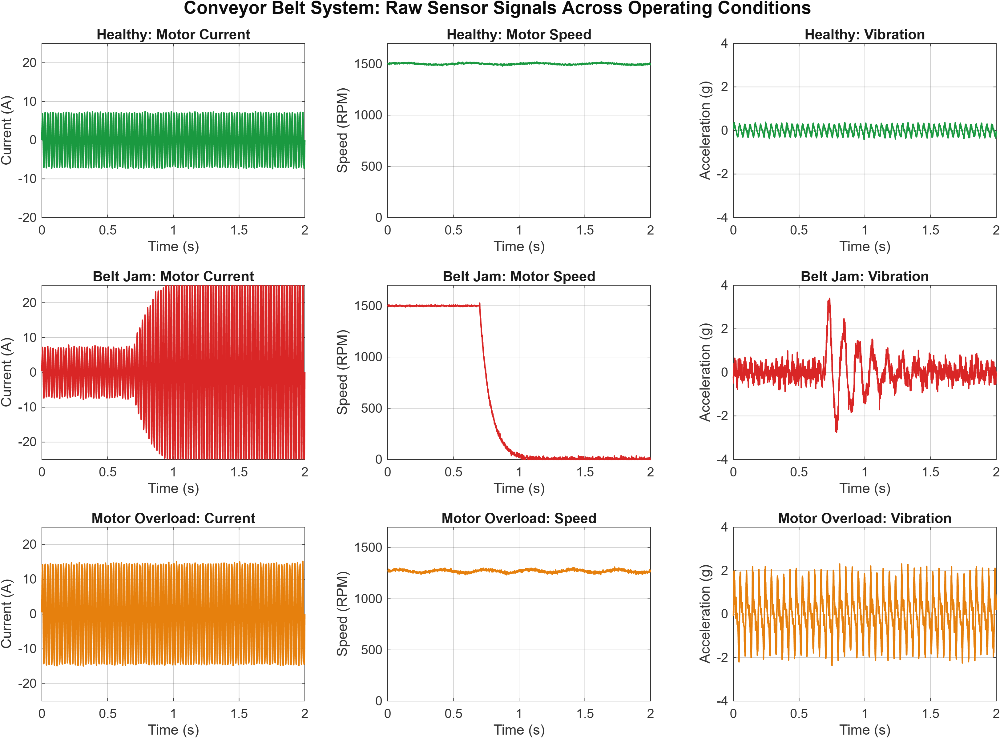
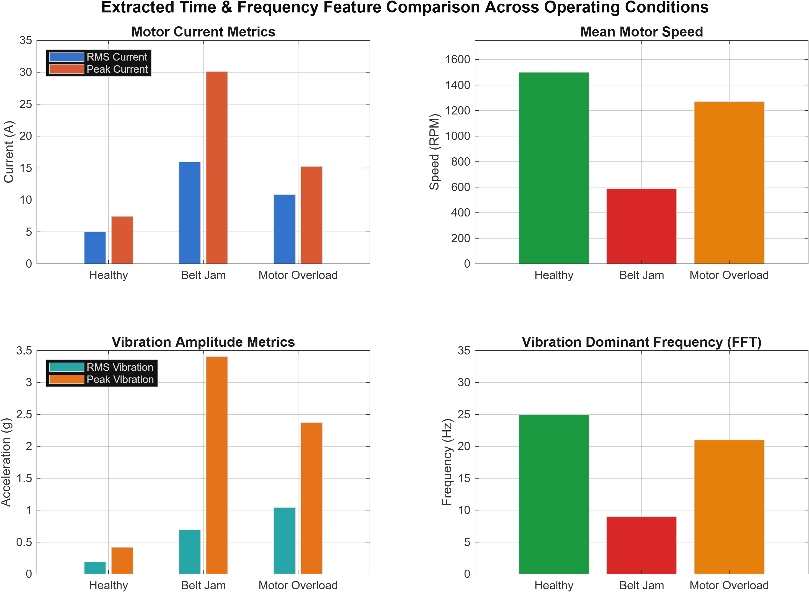
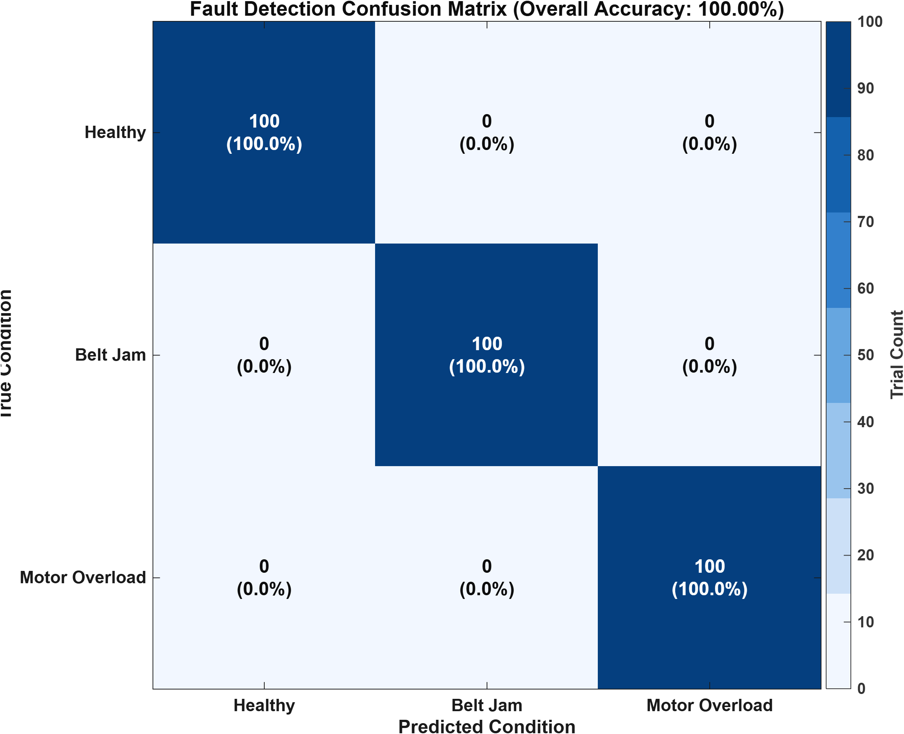

# Predictive Maintenance & Failure-Mode Detection for Industrial Conveyor Systems

An undergraduate-level (3rd-Year Electrical & Computer Engineering) MATLAB project for condition monitoring, feature extraction, and automated failure-mode classification in industrial conveyor belt drives.

---

## 1. Project Overview

Industrial conveyor systems driven by three-phase induction motors are mission-critical in mining, manufacturing, logistics, and material handling plants. Unscheduled downtime caused by mechanical jams or severe motor overloads leads to substantial financial loss and safety hazards.

This project implements a complete condition monitoring and predictive maintenance framework in MATLAB:
- **Synthetic Multi-Sensor Simulation:** Generates realistic time-series signals for **Motor Current**, **Motor Speed (RPM)**, and **Vibration Acceleration** across three operating conditions:
  1. **Healthy Operation**
  2. **Belt-Jam Fault**
  3. **Motor-Overload Fault**
- **Feature Extraction:** Computes time-domain (Root Mean Square, Peak Amplitude) and frequency-domain features (Dominant Frequency via Single-Sided Fast Fourier Transform).
- **Rule-Based Decision Logic:** Automatically classifies the machine state and triggers a safety **Emergency Shutdown Flag** upon fault detection.
- **Statistical Validation & Plotting:** Runs Monte Carlo trials to construct a confusion matrix, compute classification accuracy, and export publication-ready plots.

---

## 2. Sensor Placement & Operating Conditions

```
      +------------------+          +------------------+          +-------------------+
      |   Current CT /   |          |  Rotary Encoder  |          |  Accelerometer    |
      |   Hall Sensor    |          |   (Motor Shaft)  |          |  (Drive Bearing)  |
      +--------+---------+          +--------+---------+          +---------+---------+
               |                             |                              |
               +----------------------+      |      +-----------------------+
                                      v      v      v
                                 +--------------------+
                                 | MATLAB Diagnostics |
                                 |  & Decision Engine |
                                 +---------+----------+
                                           |
                              +------------+------------+
                              |                         |
                              v                         v
                     [Fault Mode Display]      [Emergency Shutdown]
```

### Monitored Signals
- **Motor Stator Current ($I$):** AC sinusoidal waveform at $50\text{ Hz}$ line frequency, reflecting electrical load and rotor torque demand.
- **Motor Rotational Speed ($\omega$):** Shaft angular speed in RPM, reflecting mechanical load, torque slip, or stall conditions.
- **Vibration Acceleration ($a$):** Accelerometer signal in $g$ ($1g \approx 9.81\text{ m/s}^2$), capturing rotational imbalance, bearing vibrations, and mechanical impact shocks.

### Operating Modes

| Condition | Motor Current ($I_{\text{RMS}}$) | Motor Speed ($\omega$) | Vibration Level ($a_{\text{RMS}}$) | Description |
| :--- | :--- | :--- | :--- | :--- |
| **Healthy** | Nominal ($\approx 5.0\text{ A}$) | Nominal ($\approx 1500\text{ RPM}$) | Low baseline ($\approx 0.19\text{ g}$) | Smooth conveyor motion, nominal friction, minimal vibration harmonics. |
| **Belt Jam** | Severe Surge ($\approx 16-20\text{ A}$) | Rapid Drop to $0\text{ RPM}$ | High transient shock ($> 3.0\text{ g}$ peak) | Mechanical obstruction locks the conveyor belt; rotor stalls into locked-rotor current draw. |
| **Motor Overload** | Sustained High ($\approx 10.8\text{ A}$) | Slight Drop ($\approx 1270\text{ RPM}$) | Severe sustained vibration ($> 1.0\text{ g}$) | Excessive cargo payload or continuous high mechanical drag, increasing slip and harmonic mechanical stress. |

---

## 3. Mathematical Formulation

### 3.1 Synthetic Signal Generation

The system simulates signals at a sampling frequency $F_s = 1000\text{ Hz}$ over duration $T = 2.0\text{ s}$ ($N = 2000\text{ samples}$):

1. **Healthy Condition:**
   $$I(t) = I_0 \sqrt{2} \sin(2\pi f_e t) + \eta_I(t)$$
   $$\omega(t) = \omega_{\text{nom}} + A_\omega \sin(2\pi f_{\text{ripple}} t) + \eta_\omega(t)$$
   $$a(t) = A_1 \sin(2\pi f_r t) + A_2 \sin(2\pi \cdot 2 f_r t) + \eta_a(t)$$
   where $f_e = 50\text{ Hz}$ (electrical supply), $f_r = \frac{\omega_{\text{nom}}}{60} = 25\text{ Hz}$ (mechanical 1X rotational frequency), and $\eta(t)$ represents zero-mean Gaussian measurement noise.

2. **Belt-Jam Fault:**
   At fault onset $t \ge t_{\text{jam}}$:
   $$\omega(t) = \omega_{\text{nom}} \cdot e^{-\frac{t - t_{\text{jam}}}{\tau_{\text{stall}}}} + \eta_\omega(t)$$
   $$I(t) = I_0 \sqrt{2} \left[ 1 + K_{\text{surge}} \left( 1 - e^{-\frac{t - t_{\text{jam}}}{\tau_{\text{current}}}} \right) \right] \sin(2\pi f_e t) + \eta_I(t)$$
   $$a(t) = a_{\text{baseline}}(t) + A_{\text{shock}} \sin(2\pi f_{\text{shock}} (t - t_{\text{jam}})) e^{-\frac{t - t_{\text{jam}}}{\tau_{\text{damp}}}} + \eta_a(t)$$

3. **Motor-Overload Fault:**
   $$I(t) = I_{\text{overload}} \sqrt{2} \sin(2\pi f_e t) + A_3 \sin(3 \cdot 2\pi f_e t) + \eta_I(t)$$
   $$\omega(t) = \omega_{\text{overload}} + A_{\text{mod}} \sin(2\pi f_m t) + \eta_\omega(t)$$
   $$a(t) = \sum_{k=1}^{3} C_k \sin(2\pi k f_{r,\text{overload}} t) + \eta_a(t)$$

---

### 3.2 Feature Extraction

For any discrete sampled signal $x[n]$ with $N$ samples:

1. **Root Mean Square (RMS):**
   $$\text{RMS} = \sqrt{\frac{1}{N} \sum_{n=1}^{N} x[n]^2}$$

2. **Peak Amplitude:**
   $$\text{Peak} = \max_{1 \le n \le N} |x[n]|$$

3. **Dominant Frequency (Fast Fourier Transform):**
   $$X[k] = \sum_{n=0}^{N-1} (x[n] - \bar{x}) e^{-j 2\pi k n / N}, \quad k = 0, 1, \dots, N-1$$
   The single-sided magnitude spectrum $P_1[k] = \frac{2 |X[k]|}{N}$ (for $k = 1, \dots, N/2$) is mapped to frequency $f_k = k \cdot \frac{F_s}{N}$. The dominant frequency is:
   $$f_{\text{dom}} = \arg\max_{f_k} P_1(f_k)$$

---

## 4. Fault Detection & Emergency Shutdown Logic

The decision engine compares extracted feature values against experimentally derived industrial safety thresholds:

```
                          [ Extracted Features: I_RMS, Speed_Mean, Vib_RMS ]
                                                 |
                                                 v
                      +------------------------------------------------------+
                      | Speed_Mean < 600 RPM  AND  Current_RMS >= 12.0 A ?   |
                      +--------------------------+---------------------------+
                                                 |
                               +-----------------+----------------+
                               | YES                              | NO
                               v                                  v
                     [ State: BELT JAM ]       +------------------------------------+
                     [ Shutdown: TRUE  ]       | Current_RMS >= 7.5 A  OR           |
                                               | Vibration_RMS >= 0.70 g ?          |
                                               +-----------------+------------------+
                                                                 |
                                               +-----------------+----------------+
                                               | YES                              | NO
                                               v                                  v
                                    [ State: MOTOR OVERLOAD ]           [ State: HEALTHY ]
                                    [ Shutdown: TRUE        ]           [ Shutdown: FALSE]
```

### Threshold Parameters
- **Current Overload Threshold ($I_{\text{th,overload}}$):** $7.5\text{ A}$ ($1.5\times$ nominal $5.0\text{ A}$).
- **Current Jam Threshold ($I_{\text{th,jam}}$):** $12.0\text{ A}$ ($2.4\times$ nominal).
- **Speed Low-Limit Threshold ($\omega_{\text{th,jam}}$):** $600\text{ RPM}$ ($40\%$ nominal).
- **Vibration Overload Threshold ($a_{\text{th,overload}}$):** $0.70\text{ g}$.

---

## 5. Results & Visualizations

### 5.1 Raw Sensor Signals Across Operating Conditions

The figure below illustrates the simulated multi-channel time-series data for all three operating states over a 2-second acquisition window:



- **Healthy:** Steady sinusoidal $5\text{ A}$ current, constant $1500\text{ RPM}$ speed, clean baseline vibration.
- **Belt Jam:** Sharp stall in speed at $t = 0.7\text{ s}$, immediate locked-rotor current surge up to $30\text{ A}$ peak, transient mechanical shudder spike.
- **Motor Overload:** Elevated continuous current ($15\text{ A}$ peak), reduced speed ($\approx 1270\text{ RPM}$ due to slip), and prominent harmonic vibration profile.

---

### 5.2 Extracted Feature Comparison

The bar chart below compares the time-domain and frequency-domain metrics across conditions:



### Summary Table of Extracted Features

| Operating Condition | Motor Current RMS (A) | Motor Current Peak (A) | Mean Speed (RPM) | Vibration RMS (g) | Dominant Vib Freq (Hz) | Emergency Shutdown |
| :--- | :---: | :---: | :---: | :---: | :---: | :---: |
| **Healthy** | $5.01$ | $7.44$ | $1500.1$ | $0.19$ | $25.0$ | **`false`** (Normal) |
| **Belt Jam** | $15.95$ | $30.11$ | $586.96$ | $0.69$ | $9.0$ | **`true`** (Active) |
| **Motor Overload** | $10.82$ | $15.26$ | $1270.0$ | $1.04$ | $21.0$ | **`true`** (Active) |

---

### 5.3 Monte Carlo Validation & Confusion Matrix

To evaluate the statistical robustness of the detection logic against stochastic noise and operating variances, $300$ independent Monte Carlo trials ($100$ trials per condition) were conducted:



- **Total Trials:** $300$
- **Correct Classifications:** $300$
- **Classification Accuracy:** **$100.00\%$**
- **False Alarm Rate:** $0.00\%$
- **Missed Detection Rate:** $0.00\%$

---

## 6. Project Structure

```
CONVEYER NEW/
├── .gitignore                      # Git ignore file for MATLAB temp files
├── README.md                       # Project documentation with embedded figures
├── main.m                          # Main execution pipeline and demonstration
├── simulate_conveyor_signals.m     # Synthetic multi-sensor signal generator
├── extract_signal_features.m       # Time-domain (RMS/Peak) and FFT feature extractor
├── classify_fault_mode.m           # Threshold-based classification and shutdown logic
├── evaluate_system_performance.m   # Monte Carlo multi-trial performance evaluation
├── plot_raw_signals.m              # Raw multi-channel waveform visualization
├── plot_feature_comparison.m       # Grouped bar chart feature comparator
├── plot_confusion_matrix.m         # Confusion matrix heatmap generator
└── results/
    ├── raw_signals.png             # Raw signals figure (300 DPI)
    ├── feature_comparison.png      # Feature comparison bar chart (300 DPI)
    └── confusion_matrix.png        # Confusion matrix heatmap (300 DPI)
```

---

## 7. How to Run

### In MATLAB Desktop
1. Open MATLAB.
2. Navigate to the project directory:
   ```matlab
   cd('c:/Users/samar/OneDrive/Desktop/CONVEYER NEW')
   ```
3. Run the main script:
   ```matlab
   main
   ```

### In Command Line / Terminal
Execute in batch mode:
```bash
matlab -batch "main; exit;"
```

All summary tables and performance metrics will be printed to the command window, and updated figures will be saved automatically in the `results/` directory.
